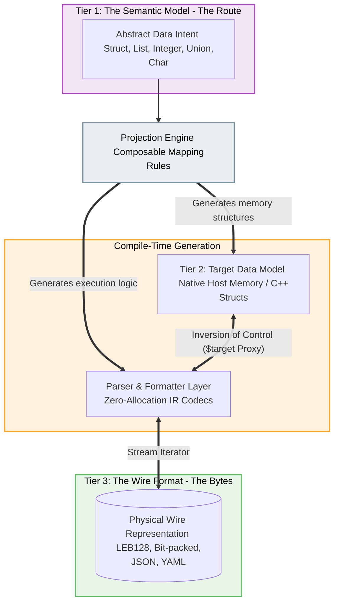

# Declarative Serialization Architecture Specification

## 0. Architectural Rationale: Why This System Exists

Here is the rewritten **Core Problem** section, focused strictly on the pain points, hardware limitations, and failure modes of traditional serialization frameworks without leaking any aspects of our specific solution:

---

### The Core Problem: The Bare-Metal Serialization Trilemma

Serialized data on embedded microcontrollers (MCUs) sits at the intersection of three mutually exclusive demands that traditional tooling cannot satisfy simultaneously:


```
                       Zero-Allocation Safety
                       (No Heap / Static RAM)
                                /\
                               /  \
                              /    \
                             /      \
                            /        \
Self-Describing Flexibility <--------> Minimal Flash & CPU Overhead
(Version-agnostic Client Schemas)     (Tight SRAM / Small Binary)
```

1. **Strict Hardware Physics (Zero-Allocation & Memory Bottlenecks):** Bare-metal firmware operates under unforgiving SRAM limits (often <32 KB), strict real-time guarantees and many other forms of architectural pressure from hardware details like bus-architecture performance factors and DMA implementation details. Complex dynamic memory allocation (`malloc`/`new`) is also forbidden due to non-deterministic latency and catastrophic heap fragmentation risks.

2. **The Failure of Existing Serialization Standards:**
   * **Text/Self-describing formats (JSON, YAML, CBOR):** Force heavy string parsing, demand intermediate dynamic memory buffers, and waste precious network bandwidth.
   * **Schema-driven binary generators (Protobuf, FlatBuffers):** Generate bloated code footprints that rapidly exhaust MCU flash, often require dynamic memory allocation for nested/variable-length structures, and force host applications to interact with awkward, non-idiomatic getters instead of native constructs.
   * **Raw C-Struct Dumps:** Fast and zero-allocation, but non-portable (alignment, padding, endianness bugs), structurally fragile, and impossible to decode without manually keeping all parties low level packet parser/formatter code in sync.

3. **The Schema Coupling Paradox:** Modern edge architectures require cloud gateways, mobile apps, and local bridges to parse telemetry dynamically without re-deploying bridge code for every minor firmware update. However, existing "self-describing" formats are too heavy for MCUs, while lightweight binary formats lock both ends of the wire into rigid, identical compile-time dependencies.

### Key Architectural Decisions

#### 1. The Tripartite Separation (Semantics, Target, Wire)
The most foundational principle of this architecture is the strict, structural decoupling of three distinct domains:
*   **The Semantic Model (The Route):** The mathematical, abstract intent of the data (e.g., `Integer(0, 255)`, `Struct`, `Union`, `List`). It contains no hardware specifics (like bit-width or endianness) and acts as the pure structural routing layer linking host memory to network bytes.
*   **The Target Data Model (The Memory):** How the host application natively stores and interacts with the data (e.g., an idiomatic C++ `struct`, a zero-copy DMA ring buffer, or a JS object). 
*   **The Wire Format (The Codecs):** The physical representation of bytes transmitted over the communication medium (e.g., bit-packed headers, LEB128 varints, or UTF-8 JSON text).

#### 2. Dual Generation via Composable Projections
Because memory layout and wire representation are completely decoupled from the semantic intent, they are bridged using a **Projection**. 

A Projection applies composable mapping rules to the Semantic tree. From this single source of truth, the compiler generates *both* sides of the serialization boundary:
1.  **Target Data Model Generation:** It emits the idiomatic, native memory structures for the host application (e.g., generating highly optimized C++ `.h` files with specific alignment requirements).
2.  **Parser/Formatter Generation:** It emits the execution logic (the generated Codec IR) responsible for seamlessly translating between the wire format and those generated host structures.

**The Result:** Developers can support arbitrary formats on both ends of the wire. You can swap a dense binary RF protocol for a human-readable JSON logging format simply by changing the composable codec components in the projection, without touching the semantic model or rewriting the host application's data structures. This enables massive code reuse and eliminates boilerplate.

#### 3. Inversion of Control (Zero-Allocation Parsers)
To guarantee zero-allocation safety, the generated parser/formatter layer **never allocates or owns memory**. Codecs operate purely as procedural bridges. They read from a stream and emit procedural instructions (like `yield_val` or `assign_span`) to a `$target` proxy. The proxy handles routing those bytes into the generated Target Data Model, keeping the wire logic blissfully unaware of the host's memory constraints.

#### 4. TypeScript as the Macro Engine (The eDSL)
Building a custom lexer, parser, type checker, and IDE extension for a custom DSL adds massive complexity and maintenance overhead. 
* By using **TypeScript as the eDSL**, Node.js acts as the compile-time engine. Standard TS syntax (`if`, `for`, `.map()`) handles compile-time type unrolling and constraint validation for free.
* By using **Tagged Template Literals (`ir` blocks)**, we maintain C-like procedural readability for runtime logic without ugly TSX/HTML tags. Standard TS interpolations `${...}` happen at compile time; the surrounding text captures runtime MCU bytecode instructions.

#### 5. Deduplication & Dual-Target IR
Because the MCU must be able to serve its own schema to dynamic clients without exhausting its flash memory, the generated parser logic is emitted as an Intermediate Representation (IR).
* **`parser.cpp` (AOT Embedded Firmware):** The IR is compiled into zero-overhead C++ code where the virtual machine completely evaporates.
* **`schema.bin` (Compressed Bytecode):** The exact same IR is packed into dense, LEB128 bytecode. Because the IR relies heavily on reusable subroutines (`CALL` / `RET`), flash footprint scales linearly with unique codec logic rather than exponentially with struct nesting.

## The Semantic Type System (The Metamodel)

The semantic type system acts as the absolute source of truth for the **logical intent** of the data. It is mathematically pure and strictly decoupled from physical constraints—meaning concepts like "bit-width," "endianness," "memory alignment," or "null-termination" do not exist here. 

The metamodel is composed of a minimal set of irreducible structural roots:

### The Primitives
*   **`Integer(min, max)`:** A bounded mathematical range. You do not define a `uint16_t`; you define an `Integer(0, 65535)`. The projection layer later decides if this is packed into 14 bits, sent as a LEB128 varint, or expanded to 32 bits for memory alignment.
*   **`Float`:** Abstract IEEE-754 semantics supporting real numbers, $\pm\infty$, and $\text{NaN}$.
*   **`Char`:** A single Unicode Scalar Value. This provides the semantic context needed for host adapters to generate native string types (e.g., `std::string` or JS `string`).

### The Structural Types
*   **`List<T>`:** Homogenous sequential data of unknown length. 
    *   *Raw Binary Blob:* Represented semantically as `List<Integer(0, 255)>`.
    *   *String:* Represented semantically as `List<Char>`.
*   **`Struct` ($\Pi$-types / Product Types):** Heterogeneous static dictionaries mapping fixed, compile-time keys to specific types.
*   **`Union` ($\Sigma$-types / Sum Types):** Tagged/discriminated sum types representing mutually exclusive semantic variants.

### The Normalization Rule (No Magic Types)
To keep the compiler's IR parser minimal, high-level constructs are aggressively normalized into the core structural types:
*   **Dictionaries / Maps are strictly prohibited as primitives.** They are structurally modeled as a `List<Struct<Key, Value>>` paired with a key-uniqueness constraint. Target adapters can later project this into a `std::map` or `HashMap`, but the wire format sees only a list of structs.

### Codec Binding via Structural Predicates

Codecs do not bind to specific, named types. Instead, they act as **declarative predicates** that filter based on topological location and structural constraints. 

Because the metamodel tracks exact integer bounds, a codec signature can express logic like: *"I can encode any integer, as long as its maximum value fits in a byte."*

